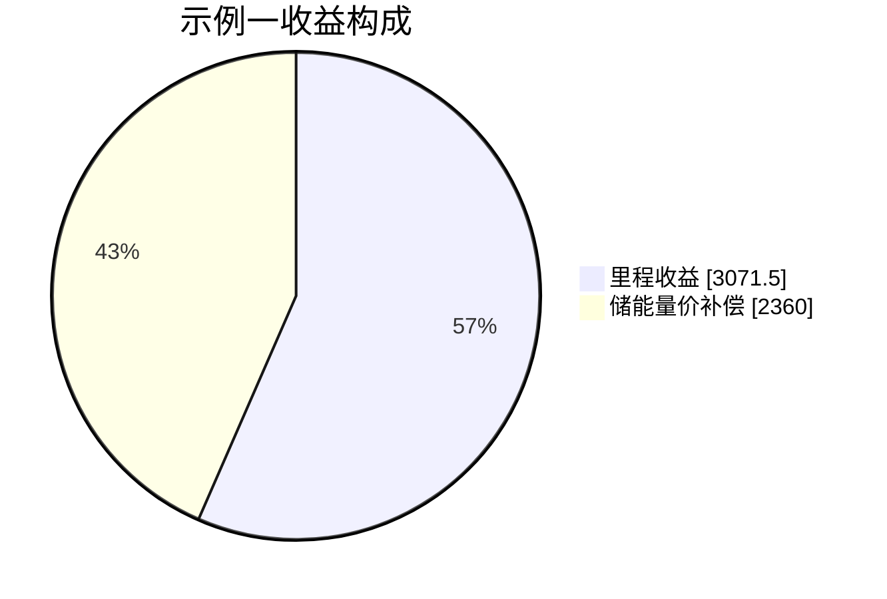

# 山西省二次调频市场研究报告

## 执行摘要

山西二次调频市场当前已经从“辅助服务补偿规则”走到了“与现货衔接的分时段市场化交易”阶段。国家层面上，entity["organization","国家发展改革委","china macro regulator"]与entity["organization","国家能源局","china energy regulator"]在 2024—2025 年连续出台关键制度：2024 年要求调频市场原则上采用“基于调频里程的单一制价格机制”，费用按“出清价格×调频里程×性能系数”计算，且调频里程价格上限原则上不超过 0.015 元/千瓦；2025 年进一步用《电力辅助服务市场基本规则》把二次调频明确定义为 AGC/APC 等自动功率控制服务，并要求省级细则与全国基本规则一致。citeturn13view0turn14view0turn13view1

山西层面上，entity["organization","国家能源局山西监管办公室","shanxi nea branch"]自 2017 年以来持续滚动修订调频规则；2024 年 6 月先通过专门通知，为独立储能参与二次调频补齐性能指标和能量补偿规则；2025 年 4 月正式印发《山西电力二次调频辅助服务市场交易实施细则》，并在政策解读中明确其与 2024 年国家价格机制通知、2025 年国家基本规则及“16 省份建设方案复函”相衔接。细则有效期为 5 年。citeturn11view0turn10search2turn20view0

就**现行公开规则**看，山西二次调频市场的核心特征不是“容量费+里程费”的双部制，而是**“容量申报、性能排序、按申报价结算、按实际调节深度付费”的单里程制**。经营主体在五个时段分别报价；调度机构按“申报价÷归一化历史性能”排序出清；中标后收益按“实际调节深度×性能折算值×申报价”计算；独立储能另有“调频量价补偿”，用于补齐调频时段内经效率折算后的充电费用与放电费用差额。换言之，山西的公开规则已经把**容量保留**嵌入准入、申报与出清，但**没有公开设置独立的容量费结算腿**。citeturn9view1turn8view0turn8view1turn7view0turn7view1turn43view0turn43view1

这会带来一个非常关键的商业含义：对储能而言，收益更像“里程收益+能量差额补偿”；对煤机尤其是高现货电价时段的煤机而言，真正约束参与意愿的往往不是调频里程本身，而是**预留上调空间的机会成本**。因此，如果要做项目投资测算或政策评估，建议在“现行规则口径”之外，再建立一个**扩展双部制估值模型**：一条腿反映容量保留价值，另一条腿反映里程/偏差执行价值。这个扩展模型不是山西现行结算规则，而是用于判断价格上限是否足以覆盖机会成本、是否需要容量型补偿的重要分析工具。citeturn13view0turn7view0turn43view1

## 政策框架与市场定位

山西二次调频市场的制度脉络，可以概括为“国家定框架、山西细化到分时段出清、现货与辅助服务深度耦合”。山西电力市场在官方表述中已形成“中长期+现货+辅助服务”的体系；2023 年底山西电力现货市场转入正式运行，这也是理解二次调频为何会从传统考核补偿，转向与现货协同出清的背景。citeturn30search5turn13view1

| 层级 | 文件 | 对二次调频的关键影响 |
|---|---|---|
| 国家 | 《电力辅助服务管理办法》 | 将辅助服务提供主体从传统发电机组扩展到新型储能、可调节负荷、聚合商、虚拟电厂等，并要求各地修订实施细则。citeturn27view0turn27view1 |
| 国家 | 《关于建立健全电力辅助服务市场价格机制的通知》 | 明确调频市场原则上采用基于调频里程的单一制价格机制；费用按“价格×里程×性能系数”计算；性能系数上限原则上不超过 2；调频里程价格上限原则上不超过 15 元/MW。citeturn13view0 |
| 国家 | 《电力辅助服务市场基本规则》 | 把调频服务明确为以减少频率偏差或联络线控制偏差为目标的二次调频服务，允许储能企业、虚拟电厂、智能微电网、车网互动等新型主体公平参与。citeturn14view0turn15view0 |
| 山西 | 《关于完善山西电力辅助服务市场有关事项的通知》 | 重点解决独立储能公平参与二次调频的问题，新增独立储能的标准调节速率、标准调节精度和标准响应时间，并要求 2024 年 7 月底前启动独立储能结算运行。citeturn20view0turn20view2turn21view1 |
| 山西 | 《电力市场规则体系 V15.0》与《山西电力二次调频辅助服务市场交易实施细则》 | 将二次调频交易与现货市场做主辅衔接，形成按五个时段报价、按历史性能排序出清、按实际调节深度结算的省级市场机制，并为独立储能增加调频量价补偿。citeturn16search2turn24view1turn9view1turn43view1 |

需要特别指出的是，山西细则明确适用于“省调并网发电机组、新型独立储能、获得准入的独立辅助服务供应商、综合能源服务商”等主体；但后两类新型主体的准入条件、补偿和分摊办法，公开文本中写明“待相关标准明确后另行明确”。这意味着：**从制度方向看，山西并未排斥需求侧与聚合主体参与；但从可操作层面看，当前公开且成熟的主体仍然是省调发电机组和独立储能。**citeturn24view1turn11view0

## 现行市场机制

### 参与主体与资源类型

从国家和区域规则看，二次调频本质上是 AGC/APC 服务，资源边界已经扩展到“源网荷储”。entity["organization","国家能源局华北监管局","north china energy regulator"]发布的华北区域辅助服务管理细则把 APC 定义为可覆盖发电机组、直控新型储能和可调节负荷的有偿辅助服务；国家基本规则则把储能企业、虚拟电厂、负荷侧资源都纳入了经营主体范围。citeturn1view3turn14view0turn27view1

但落到山西省级二次调频细则，公开规则已有明确参与路径的资源类型，分层次看可以这样理解：

| 资源类型 | 当前公开参与状态 | 关键约束 | 商业测算重点 |
|---|---|---|---|
| 煤电机组 | 当前规则下的主力主体；列入煤电容量电价适用名单的机组必须申报，迟报、漏报、无效申报或不报按上限默认参与。 | 非供热机组基本调峰能力不低于装机 35%；供热机组不低于 25%；不得因参与调频影响供热质量。 | 重点看现货机会成本、调频里程、性能系数。 |
| 燃机、水电 | 公开政策已把燃气、水电纳入与煤机、独立储能一致的性能参数折算框架。 | 仍需满足省调准入、AGC 技术标准和并网条件。 | 重点看响应性能优势与可持续保留容量。 |
| 独立储能 | 2024 年起被山西明确纳入二次调频，2025 细则下以整体作为调频资源单位申报。 | 运行上下限需与现货计划和中标调频容量协同；调节速率上限 60MW/分钟；试验期间无收益。 | 重点看里程收益、充放电价差补偿、SOC 与退化成本。 |
| 抽水蓄能 | 在国家与山西注册规则中具有明确市场主体地位；理论上可作为发电机组参与。 | 二次调频细则未像独立储能那样单列专门补偿条款；实际参与取决于省调技术准入和测试。 | 重点看机组响应速度、工况切换约束与容量电价以外的辅助服务收益。 |
| 可调负荷/聚合商/综合能源 | 国家和华北规则允许或鼓励参与；山西二次调频细则已预留“独立辅助服务供应商、综合能源服务商”条款。 | 山西公开文本尚未给出完整准入与定价细则。 | 重点看基线可验证性、遥测时延、聚合可控率。 |

表内结论依据国家、华北和山西公开规则综合判断。citeturn24view1turn24view2turn9view1turn1view3turn20view0turn23view0turn14view0

### 申报、出清、交付与考核

山西二次调频市场按五个时段组织交易：00:00–06:00、06:00–12:00、12:00–16:00、16:00–21:00、21:00–24:00。竞价日 8:30 前，调度机构发布开市信息；8:30–9:30 经营主体分别按五个时段报价；9:30–10:30 日前出清；10:30–17:30 审核；17:30 前发布结果。若日内边界条件显著变化，可对尚未执行的时段重算，并在实际运行时段开始前 30 分钟完成。citeturn6view1turn6view2turn6view3turn4view4

该流程来自山西 2025 细则公开时序。citeturn6view1turn6view2turn6view3turn4view4turn7view2

山西的需求量做法也值得注意：调频市场各时段可调容量需求，暂定为该时段直调发电需求最大值的 5%—15%，并允许调度机构按实际运行需要动态调整。报价区间则按日内时段差异设定：凌晨、早高峰、后夜为 5—15 元/MW；中午低谷、晚高峰为 10—15 元/MW。citeturn4view1turn9view1

出清不是简单按价格排序，而是按**“排序价格”**排序。排序价格定义为原始申报价除以归一化后的历史性能指标；历史性能取最近一个被调用日、向前最多 15 天；若历史性能小于等于 1，则该资源不予调用。归一化方法采用分段函数：当性能指标高于饱和值时记为 1，低于最小值时记为 0.1；当前公开参数为 `Kpmin=1`、`Kpsaturation=6`。这使得山西市场实际上是**价格竞争+性能竞争的混合排序机制**。citeturn8view0turn8view1turn8view2

在交付与考核上，山西规则较为严格。中标机组必须严格执行 AGC/ACE 控制及调度计划；运行日可随机抽查 1 台中标资源，若性能不达标，则当日不获得调频收益。性能不达标包括两类：一是调频性能指标不达标；二是实际最大可调节范围与申报上下限偏差超过 10%。此外，若电网发生断面越限、事故处理或阻塞，调度机构可退出相关机组的 ACE 模式；试验期间不获得收益。citeturn5view0turn6view5

### 结算与费用分摊

公开规则下，山西二次调频的结算公式是：

`调频收益 = 实际调节深度 D^R × 性能指标折算值 K结算 × 该时段申报价`

其中，`D^R = Σ D^R(i,j)`，即一个时段内所有 AGC 动作“调节深度”的总和；计量时调频指令最短历时暂按 30 秒。性能折算采用“把当时段全体机组最大实际性能折算到 2”的方式，计算折算比例 `λ=2/max(K实际)`；随后再按公开的 α、β 系数折算，当前 α 暂定 0.5、β 暂定 0.8。citeturn7view0turn7view1

这意味着山西二次调频是**按申报价结算的 pay-as-bid 机制**，而不是统一边际电价机制。细则虽会形成“边际调频资源”，但条文又明确“各调频服务供应商按照申报价格进行结算”。因此，估算项目收益时，不能只盯市场均价，更要看**自身报价、性能归一化结果和实际被调用里程**。citeturn8view1turn9view1

在独立储能方面，山西又叠加了一条非常关键的“能量补齐”规则：若储能因提供二次调频服务，导致当月参与调频时段的充电费用大于放电费用，则按“充电电费×能量转换效率−放电电费”给予调频量价补偿，差值为负则不补；同时，独立储能在中标调频市场后，其运行上下限要先扣除调频中标容量，再参与现货电能量市场出清。这个设计实质上承认了储能在调频场景下的**能量吞吐成本与 SOC 约束**。citeturn43view0turn43view1

费用分摊方面，山西采取“日清月结、随电费结算”。调频市场月度总费用先由跨省跨区外送电量承担规定部分，剩余费用再在省内按“发电侧未参与电能量市场的总上网电量”和“用户侧总用电量”的比例分摊；居民生活、农业生产以及光伏扶贫项目上网电量暂免承担。citeturn2view1turn7view2

## 测算框架与示例

### 现行规则口径

若严格按山西现行公开规则测算，一个调频资源在时段 `s` 的收益可写为：

`R_current(s) = D(s) × Ksettle(s) × b(s) + Ces(s)`

其中：

| 符号 | 含义 | 单位 |
|---|---|---|
| `D(s)` | 该时段实际调节深度总和 | MW |
| `Ksettle(s)` | 性能折算值 | 无量纲 |
| `b(s)` | 该时段中标申报价 | 元/MW |
| `Ces(s)` | 仅独立储能适用的调频量价补偿 | 元 |

如果进一步追到性能源头，则山西与国家口径一致，采用 `Kp = K1 × K2 × K3`：调节速率、调节精度、响应时间三项乘积；山西 2024 年又对独立储能做了专门优化，明确标准调节速率按“山西最优煤电机组主机对应设计参数”折算，独立储能调节速率不超过 60MW/分钟，允许偏差量按额定功率的 1%、最小 1MW，标准响应时间 60 秒。citeturn20view0turn23view0turn23view1turn23view2

### 项目评估扩展口径

若用于项目投资决策，仅按山西现行单里程制往往不够，因为容量保留造成的机会成本没有在公开结算公式里单列。为此，可建立一个**扩展双部制估值模型**。这不是山西现行结算，而是分析工具。未指定的部分，假设如下。

`R_extended(s) = Qcap(s) × h(s) × Pcap(s) + D(s) × K(s) × Pmile(s) + Ces(s) - Cdeg(s) - OC(s)`

其中：

- `Qcap(s)`：保留的可调用调频容量，**未指定，假设为**运行上下限、爬坡速率、SOC 窗口和网络约束共同作用后的可交付容量；
- `Pcap(s)`：容量费价格，**未指定，假设为**分析性参数，用于检验是否需要容量腿；
- `Pmile(s)`：里程价格；在山西现行规则下，可用中标申报价代替；
- `Cdeg(s)`：储能退化成本，**未指定，假设为**按吞吐电量乘以单位退化成本；
- `OC(s)`：机会成本。对火电，可近似写为  
  `OC ≈ (现货电价 - 边际发电成本)^+ × 保留上调容量 × 时长`；  
  对储能，可近似写为  
  `OC ≈ SOC 影子价值 × 被锁定能量`。  

这一扩展模型的用途不是替代现行规则，而是判断：**当前 15 元/MW 的里程报价上限，是否足以在高现货价时段覆盖煤机保留容量损失；以及储能是否需要额外容量腿才能形成稳定现金流。**其思想与现有独立储能商业模式研究中“辅助服务收益+容量收益+电能量收益”的三元结构是一致的。citeturn13view0turn38view1

### 如何用历史数据估算可提供容量、里程与边际价格

实际建模时，建议按以下逻辑做：

先用 AGC 指令与响应曲线逐条切分“调节事件”，对每条事件计算 `K1、K2、K3、Kp、D`；再在 1 秒、4 秒、15 秒或站内实际采样粒度上，将每个时刻的可提供容量写为：

`Qavail(t) = min{Qup(t), Qdown(t), RampLimit(t), SOCLimit(t), NetLimit(t)}`

其中，`SOCLimit(t)` 在公开细则中未给出统一公式，**未指定，假设为**由当前 SOC、可用能量窗口、回路效率和允许偏置时长共同约束。保守做法是把一个交易时段内 `Qavail(t)` 的 10%分位数或最小值作为投标容量；中性做法则取 25%分位数。里程 `D` 的预测则可用历史相同月、相同时段、相近新能源出力/负荷条件的样本均值或分位数。citeturn7view0turn8view0turn23view0turn23view2

边际价格的推导要区分“公开数据”和“内部数据”两种场景。若掌握完整投标栈，则直接按 `Ci = bid_i / λ(Kp_i)` 排序，累计容量刚好跨越需求 `Pdemand` 的资源就是边际资源，其排序价即边际排序价；再乘回本资源的性能折算因子，就可反推出其原始申报价。若只有公开数据，则因为山西只披露中标机组性能指标的均值/最大值/最小值和结算均价，而不披露完整未中标投标栈，故只能做区间估计，难以严格重建边际价格。citeturn8view1turn4view4

### 示例计算

**示例一：独立储能按山西现行规则测算**。  
未指定，假设为：某独立储能在 16:00–21:00 时段中标，申报价 12 元/MW；当时段实际调节深度 `D=180MW`；本机 `K实际=1.60`；当时段全体中标资源最大实际性能为 1.80，则 `λ=2/1.80=1.111`。由于 `λ>α(0.5)`，按公开公式 `K结算=β×λ×K实际=0.8×1.111×1.60=1.422`。里程收益为 `180×1.422×12=3071.5 元`。若当月储能调频时段充电电费 22000 元、放电电费 17000 元、效率取 0.88，则调频量价补偿为 `22000×0.88−17000=2360 元`。该样本总收益为约 `5431.5 元`。公式口径依据山西现行规则，数值为示例假设。citeturn7view0turn7view1turn43view1

| 项目 | 数值 |
|---|---:|
| 时段 | 16:00–21:00 |
| 中标申报价 | 12 元/MW |
| 实际调节深度 `D` | 180 MW |
| 本机 `K实际` | 1.60 |
| 时段最大 `K实际` | 1.80 |
| 折算比例 `λ` | 1.111 |
| 结算性能 `K结算` | 1.422 |
| 里程收益 | 3071.5 元 |
| 储能调频量价补偿 | 2360 元 |
| 合计收益 | 5431.5 元 |

**示例二：扩展双部制下的容量价值检验**。  
未指定，假设为：某 600MW 煤机在 16:00–21:00 时段为提供上调能力，需要预留 30MW 头寸；现货电价 420 元/MWh，机组边际发电成本 260 元/MWh。则单看容量保留的机会成本约为 `（420−260）×30×5=24000 元`。若同一时段按现行山西规则预计可获得调频收益 `D=250MW、K结算=1.30、申报价=15 元/MW`，则只有 `250×1.30×15=4875 元`。若引入分析性的容量费 `Pcap`，则盈亏平衡所需容量价格约为 `(24000−4875) / (30×5) = 127.5 元/MW·h`。这说明：在高现货价时段，**仅靠现行里程腿，煤机可能难以覆盖容量保留损失**。这不是对现行规则“失效”的判断，而是对“价格上限+单里程制”在尖峰时段激励强度的定量检验。citeturn13view0turn7view0turn9view1

## 数据、验证与敏感性

要把上述模型从“纸面公式”变成可投标、可复盘、可审计的收益模型，至少需要六类历史数据：

| 数据项 | 典型来源 | 口径/分辨率 | 获取难度 | 主要用途 |
|---|---|---|---|---|
| AGC 指令、ACE/设点值、指令起止时间 | 调度机构、辅助服务技术支持系统 | 秒级或事件级 | 高 | 计算 `D、K1、K2、K3` |
| 实际响应功率曲线、AGC/ACE 投退状态 | 机组 DCS/EMS；储能 PCS/BMS/EMS | 秒级 | 高 | 验证跟踪质量、识别异常事件 |
| 基准出力、现货日前/实时计划、运行上下限 | 调度机构、交易平台、企业日报 | 15 分钟至秒级 | 高 | 重建机会成本和可交付容量 |
| 市场申报价、中标容量、结算结果 | 交易机构、企业内部台账 | 时段级 | 中高 | 反推边际排序价与投标策略 |
| 电能量价格、充放电电费、SOC、效率 | 交易平台、计量系统、储能 EMS | 15 分钟至小时级 | 中 | 计算 `Ces` 与 SOC 约束 |
| 机组技术参数、燃料成本、启停/供热约束 | 企业生产系统、财务系统 | 日级至月级 | 中 | 机会成本、边际成本和情景分析 |

公开规则已经明确，辅助服务计量的依据包括“电力调度指令、EMS、发电机组调节系统运行工况在线上传系统、WAMS 以及电能量采集计费系统”等。也正因如此，真正决定测算精度的“原始 AGC 数据”通常掌握在调度、交易和企业三端，不是完全公开数据。公开信息层面，山西目前主要披露的是中标机组性能指标的均值、最大值、最小值以及结算均价，无法完整复原投标栈。citeturn2view1turn4view4

敏感性分析建议至少做三层。第一层做单因素分析：对 `D、K、申报价、现货价差、效率、SOC 窗口、退化成本` 做 ±10% 或 ±20% 扰动。第二层做双因素分析：煤机重点画“现货价差—容量费”的热力图；储能重点画“里程—退化成本”或“效率—SOC 可用窗口”的热力图。第三层做历史重抽样：按月份、负荷类型、新能源高渗透时段对真实 AGC 事件做 bootstrap，直接输出收益分布而不是单点值。由公式本身可知，储能收益对 `D、K、申报价` 近似一比一线性敏感；煤机净收益则通常对**现货电价与边际成本的价差**最为敏感。citeturn7view0turn43view1

## 结论与建议

对山西当前二次调频市场，最重要的结论有三点。

第一，**山西已经形成了比较完整、可执行、与现货耦合度较高的省级二次调频市场规则**。五时段交易、性能归一化出清、按申报价结算、日清月结、储能能量补偿，这些要件都已经具备。对独立储能而言，山西在全国属于制度较前沿的地区。citeturn11view0turn24view1turn43view1

第二，**现行公开规则更适合激励“高性能里程提供者”，但对“高机会成本容量保留者”的激励未必充分**。这对独立储能通常是利好，因为储能高响应、高精度、低响应时间的优势能直接转化为性能收益；但对煤机，尤其在晚高峰现货价格高的时段，仅有里程腿而无显式容量腿，可能不足以覆盖其保留上调空间的损失。由此推断，未来若山西进一步做规则优化，最值得评估的不是“是否要推翻现行里程制”，而是**是否要引入可选的容量腿、或至少建立动态价格上限和尖峰时段差异化激励**。citeturn13view0turn9view1turn7view0

第三，**需求侧、虚拟电厂、综合能源服务商是方向明确但公开细则仍未完全落地的增量资源**。国家基本规则和华北区域规则已经放开了这类主体，山西公开细则也为独立辅助服务供应商、综合能源服务商留了入口；但准入、遥测、基线和结算条款还不够公开化、标准化。政策上，山西下一步最有价值的工作，是把“独立储能已落地的技术—结算链路”复制到负荷侧和聚合侧。citeturn14view0turn1view3turn24view1

基于上述判断，建议如下：

其一，针对监管与规则设计，建议在不改变现行主框架的前提下，评估建立**“里程主结算+容量附加激励”**的可行路径，至少可先在晚高峰和新能源波动显著时段做试点；同时，考虑把当前固定的 5—15 元/MW、10—15 元/MW 区间，逐步改为与现货波动、系统需求和历史里程分布联动的动态上限。这个方向与国家“合理确定需求、不得事后调公式”的要求并不冲突，反而更符合按效果付费、按需采购。citeturn13view0turn11view0

其二，针对储能，建议继续巩固独立储能的制度优势，但把补偿从“成本补齐”进一步推进到“价值显化”。当前规则已经补了能量差额，但还没有充分反映 SOC 被锁定、循环寿命损耗和频繁切换的成本。更稳妥的做法，是在保持现行量价补偿的同时，把退化参数透明化、标准化，并允许企业在申报时体现更细粒度的时段成本。citeturn43view1turn20view0

其三，针对抽水蓄能与燃机，建议尽快明确其在二次调频市场中的专项交付规则、工况边界和收益归属，避免只具备主体资格、但缺乏明确结算路径。尤其抽水蓄能既有容量电价，又具备用于调峰、调频、备用的系统价值，应通过省级细则把“容量电价”和“辅助服务交易收益”边界说清楚。citeturn41search7turn14view0turn9view3

其四，针对数据披露，建议提高可复盘性。至少可以按月公开各时段的需求区间、入市容量、边际排序价分布、中标容量、历史里程分布、性能系数分布以及储能量价补偿总额。当前仅公布均值、最大值、最小值和均价，不足以支持社会化投资的精细化建模。citeturn4view4

## 开放问题与局限

公开资料仍有三点不足。其一，山西二次调频细则虽然写入了“独立辅助服务供应商、综合能源服务商”，但其准入测试、性能门槛和分摊办法尚未完整公开。其二，公开信息不足以重建完整投标栈，因此外部研究者很难精确还原边际价格。其三，抽水蓄能、负荷聚合和综合能源服务商在山西二次调频中的实际入市规模，公开数据仍然有限。以上部分会影响投资测算精度，但不改变本文对现行机制的主要判断。citeturn24view1turn4view4

## 主要参考链接

- 《关于建立健全电力辅助服务市场价格机制的通知》 citeturn13view0  
- 《电力辅助服务市场基本规则》及印发通知 citeturn13view1turn14view0  
- 《电力辅助服务管理办法》及答记者问 citeturn27view0turn27view1  
- 《关于促进新型储能并网和调度运用的通知》 citeturn28search0  
- 《关于完善山西电力辅助服务市场有关事项的通知》及政策解读 citeturn20view0turn21view1  
- 《山西电力二次调频辅助服务市场交易实施细则》及政策解读 citeturn10search2turn11view0turn40search2  
- 《电力市场规则体系 V15.0》相关条款 citeturn16search2turn43view1  
- 《华北区域电力辅助服务管理实施细则》 citeturn1view3  
- 山西电力现货市场与“中长期+现货+辅助服务”体系的官方表述 citeturn30search5